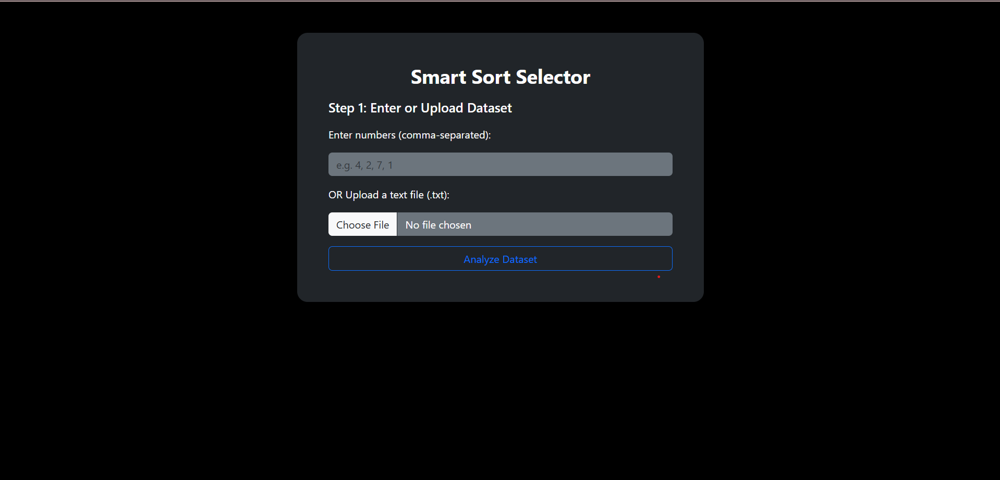

# Smart-Sort-Selector

Smart-Sort-Selector is a Python-based program that dynamically selects and applies the most efficient sorting algorithm based on the input data size and characteristics. It helps demonstrate the practical advantages of different sorting techniques and how algorithm selection impacts performance.

## Features

- Automatically selects between Bubble Sort, Insertion Sort, Merge Sort, and Quick Sort.
- User-friendly input interface for entering data.
- Displays sorted output and the chosen sorting algorithm.
- Designed for educational and experimental purposes.

## Technologies Used

- **Python 3.x**
- Standard libraries (no external dependencies)

## How to Run

1. Clone this repository:

   ```bash
   git clone https://github.com/Divyansh3105/Smart-Sort-Selector.git
   ```

2. Navigate to the project directory:

   ```bash
   cd Smart-Sort-Selector
   ```

3. Run the Python script:

   ```bash
   python smart_sort_selector.py
   ```

## Screenshots

<div align="center">
    
</div>

## Contributing

Contributions are welcome! Feel free to fork this repository and submit a pull request.

## License

This project is open-source and available under the [MIT License](LICENSE).

---

✨ **Explore how smart sorting can make a difference!**

## Author

**Divyansh Garg**

## Contact

- 📧 Email: divyanshgarg3105@gmail.com
- 🌐 GitHub: [@Divyansh3105](https://github.com/Divyansh3105)
